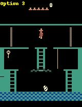
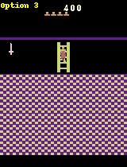
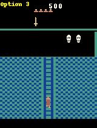
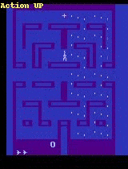
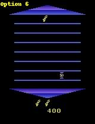

Options visualization
=====================

Learned options are not always easily interpretable by humans. We did find that some options in the following environments seem to have clear roles.

## Montezuma's Revenge

The agent uses option 3 to go and fetch the key in the first room. 
It then switches to option 5 to jump down, losing a life which allows him to go back more quickly to the starting point.
It goes back to option 3 to head to the next room.

The agent also uses option 2 to pick up the sword in an another room, and option 1 to jump at an ennemy when holding it.

## Alien

The agent uses the options to memorize a trajectory through the maze.

## Asterix

The agents uses an option to go down while getting the targets, and another to go up and hit them.

